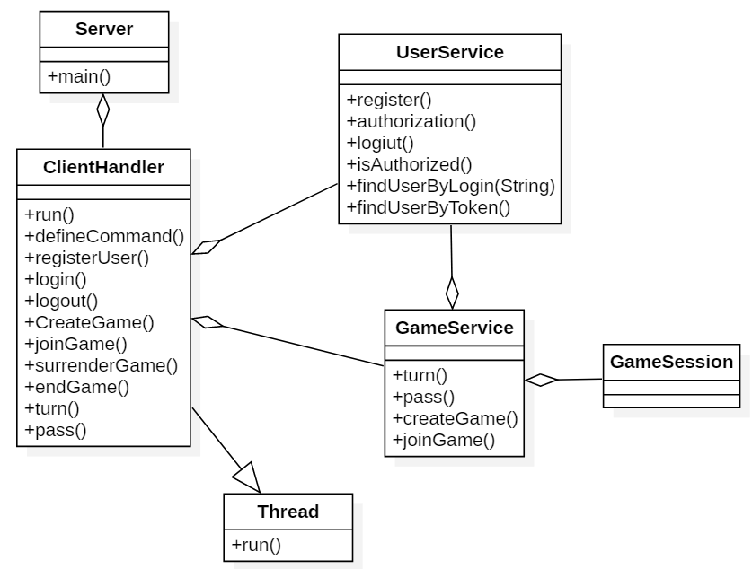
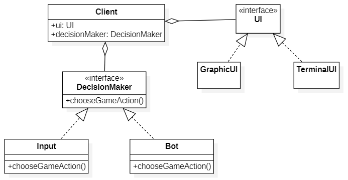

# Сетевая игра Го

Данный проект представляет собой реализацию игры Го на языке программирования Java с использованием клиент-серверной
архитектуры. В игре присутствует возможность многопользовательской игры, где игроки могут соревноваться друг с другом в
партиях Го.

<a name="Содержание"></a>

## Содержание

1. [Описание](#Описание)
2. [Правила игры](#Правила-игры)
3. [Структура проекта](#Структура-проекта)
4. [Архитектура](#Архитектура)
5. [Структура сервера](#Структура-сервера)
6. [Структура клиента](#Структура-клиента)
7. [Протокол зваимодействия между сервером и клиентом](#Протокол-взаимодействия)


<a name="Описание"></a>

## Описание

Игра Го - это древняя стратегическая настольная игра для двух игроков, в которой игроки чередуются размещать камни на
пересечениях линий игрового поля. Цель игры - захватывать территорию и пленять камни противника. Данный проект реализует
игру Го с возможностью игры по сети через клиент-серверную архитектуру.

<a name="Правила-игры"></a>

## Правила игры

### Игровая доска

Игровая доска в Го представляет собой квадрат размером 19x19 клеток (на традиционном доске). Также используются доски
размером 13x13 или 9x9 клеток для более коротких партий.

### Камни

Игроки используют два различных цвета фишек (черные и белые). Черные обычно ходят первыми.
Рядом стоящие камни образуют группу. Обратите внимание, что камни соединяются только по расчерченным горизонтальным и
вертикальным линиям.
По диагонали камни НЕ соединяются!

### Ходы

Два игрока (черные и белые) ходят по очереди. Первый ход делают черные.
Во время своего хода игрок может поставить одну свою фишку на пустую клетку на доске.
При каждом ходе на доску выставляется один камень. Камень ставится на пересечение линий.
Игроки выставляют камни на доску так, чтобы отгородить как можно больше территории. Камни — это своего рода строительный
материал для возведения стен.
Однажды поставленный камень никогда не передвигается!

### Захват

У каждого камня, поставленного на доску, есть “дыхания” — это соседние пустые пункты доски, напрямую связанные с камнем
линией. У камня в центре 4 дыхания, на краю — 3, а в углу — 2. Если у камня перекрыть все пункты дыхания, то он
снимается с доски. Каждый захваченный камень приносит одно дополнительное очко!

Когда фишки одного цвета окружают группу фишек другого цвета снизу и сверху (по горизонтали или вертикали), группа фишек
врага захватывается и удаляется с доски.

Ситуация, когда до захвата камня или группы камней остается один ход, называется `атари`.

### Запрещенные действия

* Запрет на самоубийство. Нельзя ставить камень в позицию, когда он будет сразу захвачен.
* Нельзя повторять позицию предыдущего хода. Его называют правилом ко, и оно так же логично и необходимо, как и запрет
  на самоубийство.

### Конец игры

Игра заканчивается, когда оба игрока по очереди пропускают свой ход или когда оба игрока согласны на завершение игры.
После окончания игры производится подсчет очков.

### Подсчет очков

Очки подсчитываются в конце игры. Игрок получает одно очко за каждую свою фишку на доске и дополнительные очки за
захваченные фишки противника и территории, которую он захватил.

Так как черные начинают игру первыми, у них есть небольшое преимущество: они первыми захватывают углы, первыми атакуют и
т.д. И для того чтобы уравнять начальные условия игроков, ввели правило, согласно которому белым добавляется 6,5 очка
компенсации. Половинка очка не позволит закончить партию вничью. Эта компенсация называется коми.

[К оглавлению](#Содержание)

<a name="Структура-проекта"></a>

## Структура проекта

директория modules:

* bots
    * random-bot
* dto
* dto-validator
* game
* json-converter
* logger
* model
* player-actions
* server
* server-exception
* service
* user-interface
    * terminal-ui
* validation

[К оглавлению](#Содержание)

<a name="Архитектура"></a>

## Архитектура

Проект реализован в виде клиент-серверной архитектуры:

Сервер: Обрабатывает запросы от клиентов, управляет игровыми сессиями, поддерживает правила игры и взаимодействие между
игроками.

Клиент: Взаимодействует с сервером, отображает игровое поле, позволяет игрокам или боту делать ходы и следить за ходом
игры.

[К оглавлению](#Содержание)

<a name="Структура-сервера"></a>

## Структура сервера

Класс *Server* имеет точку входа main. При получении нового соединения через Socket, создается экземпляр класса
ClientHandler и передается в ExecutorService для управления этим потоком.


<a name="Структура-клиента"></a>

[К оглавлению](#Содержание)

## Структура клиента

Класс клиент хранит в себе реализацию пользовательского интерфейса *UI*, а также способ принятия решений (бот или
пользовательский ввод). Реализация интерфейса отображения и способ принятия решений задаются в конфигурационном файле.

flowchart TB
node

[К оглавлению](#Содержание)

<a name="Протокол-взаимодействия"></a>

## Протокол взаимодействия между сервером и клиентом

### Регистрация на сервере

Запрос

```json
{
  "request-type": "registration",
  "login": "login",
  "password-hash": "password_hash"
}
```

Ответ

```json
{
  "message": "You was successfully registrated!",
  "status": "success"
}
```

```json
{
  "message": "This login already exists!",
  "Incorrect login!",
  "status": "failure"
}
```

---

### Авторизация на сервере

Запрос

```json
{
  "request-type": "login",
  "login": "login",
  "password-hash": "password_hash"
}
```

Ответ

```json
{
  "message": "You entered!",
  "status": "success",
  "token": "UID"
}
```

```json
{
  "message": "Invalid login or password!",
  "status": "failure"
}
```

### Выйти из аккаунта

Запрос

```json
{
  "request-type": "logout",
  "token": "UID"
}
```

Ответ

```json
{
  "message": "You've log out!",
  "status": "success"
}
```

```json
{
  "message": "You're not authorized!",
  "Something bad happened!",
  "status": "failure"
}
```

---

### Создать игру

Запрос

```json
{
  "request-type": "create_game",
  "with-bot": true,
  false,
  "color": "WHITE",
  "BLACK",
  "EMPTY",
  "size": 9,
  13,
  19,
  "token": "UID"
}
```

Ответ

```json
{
  "message": "Have a good game!",
  "status": "success",
  "game-id": "game_id"
}
```

```json
{
  "message": "You're not authorized!",
  "Server is temporarily unavailable!",
  "status": "failure"
}
```

---

### Присоединиться к игре

Запрос

```json
{
  "request-type": "join_game",
  "game-id": "game_id",
  "token": "UID",
  "color": "WHITE",
  "BLACK"
}
```

Ответ

```json
{
  "message": "Have a good game!",
  "status": "success"
}
```

```json
{
  "message": "You're not authorized!",
  "There are two players already!",
  "Server is temporarily unavailable!",
  "status": "failure"
}
```

---

### Во время игры

### Сделать ход

Запрос

```json
{
  "request-type": "turn",
  "token": "UID",
  "color": "BLACK",
  "WHITE",
  "row": "row",
  "column": "column"
}
```

Ответ

```json
{
  "message": "You can move!",
  "status": "success",
  "game-field": "game_field"
}
```

```json
{
  "message": "Invalid move!",
  "Something bad happened!",
  "status": "failure",
  "game-field": "game_field"
}
```

---

### Пропустить ход

Запрос

```json
{
  "request-type": "pass",
  "token": "UID"
}
```

Ответ

```json
{
  "message": "You can pass!",
  "status": "success",
  "game-field": "game_field"
}
```

```json
{
  "message": "Something bad happened!",
  "status": "failure",
  "game-field": "game_field"
}
```

### Сдаться

Запрос

```json
{
  "request-type": "surrender",
  "token": "UID"
}
```

Ответ

```json
{
  "message": "You're so miserable!",
  "status": "success",
  "game-field": "game_field"
}
```

```json
{
  "message": "Something bad happened!",
  "status": "failure",
  "game-field": "game_field"
}
```

---

### В конце игры

### Закончить игру

Запрос

```json
{
  "request-type": "finish_game",
  "game-id": "game_id"
}
```

Ответ

```json
{
  "message": "Game over!",
  "status": "success",
  "white-score": "white_score",
  "black-score": "black_score"
}
```

```json
{
  "message": "End of game haven't reached yet!",
  "Something bad happened!",
  "status": "failure"
}
```